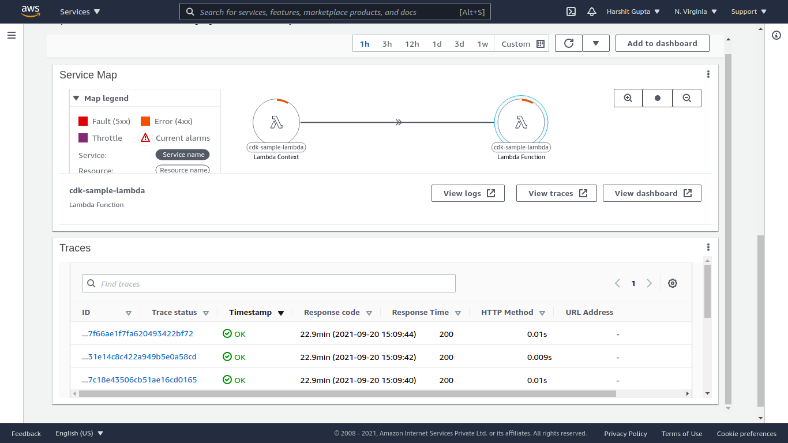
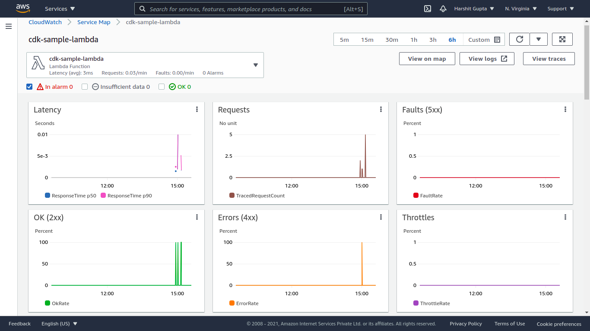
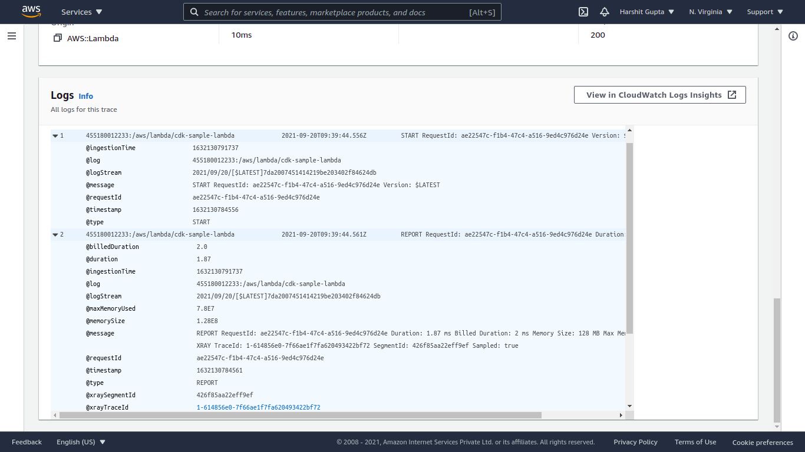
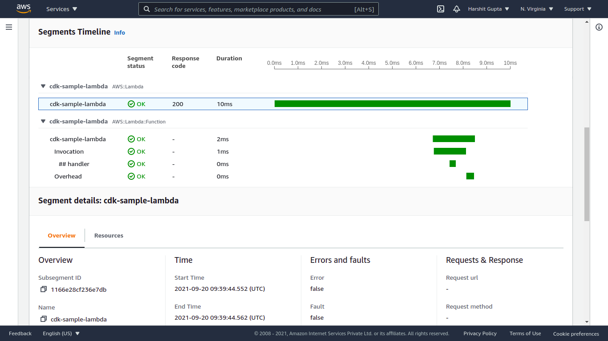

# CDK Python Sample with lambda power_tools

## Usage

### Prerequisites

- nodejs and npm
- aws-cli installed and configured with a default account
- aws-cdk cli installed
- python & pip

### Try it yourself

```bash
git clone https://github.com/harshit9715/cdk-python.git
cd cdk-python
python -m pip install -r requirements.txt
python -m pip install aws-cdk-aws-sam
cdk synth # validate the stack
cdk deploy

# After usage
cdk destroy
```

### Snapshots

#### Service Lens



#### Metrics



#### Structured Logs



#### Segments

